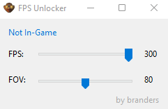

# MW2 2009 FPS and FOV Unlocker :unlock:

Tool for changing the max fps and fov for mw2 (2009) because they do not provide it.

1. Download the exe file from releases: [https://github.com/Chopper1337/mw2-fps-unlocker/releases/](https://github.com/Chopper1337/mw2-fps-unlocker/releases/latest)
2. Start FPS Unlocker
3. Start MW2 through steam
4. Change sliders to your preference

If you are running the game through Proton, you may need to use the self-contained version (`-SC`)

## Screenshot

## Notes

This is for MW2 released in 2009.

No recorded vac-bans. Use at your own risk.
